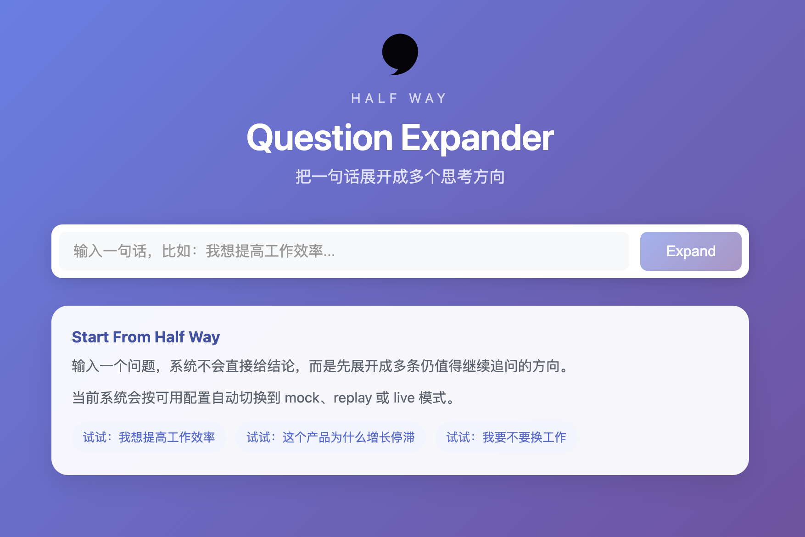

# Half Way Demos

Interactive demos for thought expansion, reflective workflows, and structured human-AI collaboration.

This repository collects small but intentional product demos built around one core idea:

Instead of rushing to answer, help people unfold a question into better paths of thinking.

## What This Repository Is For

The main product and protocol repositories should stay focused on core capabilities.

This repository is for demos that are easy to open, explain, run, and share.

It is meant for:

- product exploration
- concept validation
- internal demos
- external walkthroughs
- interaction experiments around human-AI thinking workflows

## Featured Demo

### Question Expander

Turn one sentence into multiple unfinished paths worth exploring.

Question Expander is designed to show how an interface can help people continue thinking before jumping to a final answer.

It supports:

- multi-level question expansion
- pause-and-reflect checkpoints
- focus mode for deep branches
- Markdown export of the explored branch
- replay mode for stable demos
- live mode for OpenAI-compatible LLM backends

Demo path: `demos/question-expander`



## Included Demos

- `question-expander`

## Design Principle

These demos are not optimized for instant answers.

They are optimized for:

- opening up a question
- surfacing blind spots
- showing multiple paths
- preserving intermediate thinking
- helping people continue, not just conclude

## Quick Start

To run the first demo locally:

```bash
cd demos/question-expander
npm install
npm run adapter:replay
```

Then in a second terminal:

```bash
cd demos/question-expander
npm run dev
```

Open `http://localhost:5173`.

## Repository Structure

```text
demos/
  question-expander/
assets/
  screenshots/
  gifs/
docs/
  demo-briefs/
tools/
```

## Running A Demo

Each demo has its own folder and README.

General flow:

1. Go to the demo directory.
2. Install dependencies.
3. Start the demo adapter or backend if needed.
4. Run the frontend locally.
5. Open the local URL in your browser.

## Current Status

This repository starts with `Question Expander` as the first complete demo.

More demos may be added later, such as:

- pause-card
- reflection-loop
- decision-tree

## Why Half Way

Half Way is about staying in the productive middle of thought.

Not stopping at the first answer.
Not collapsing uncertainty too early.
Not treating thinking as a one-shot response.

Instead, it creates space to explore what is still unfinished.

## Notes

Some demos support two modes:

- `replay`: stable and presentation-friendly
- `live`: connected to a compatible LLM backend

For public demos, replay mode is usually the recommended default.

## Roadmap

Near-term goals:

- publish the first demo cleanly
- add short gifs for each demo
- standardize demo setup patterns
- expand the collection with more interaction prototypes
